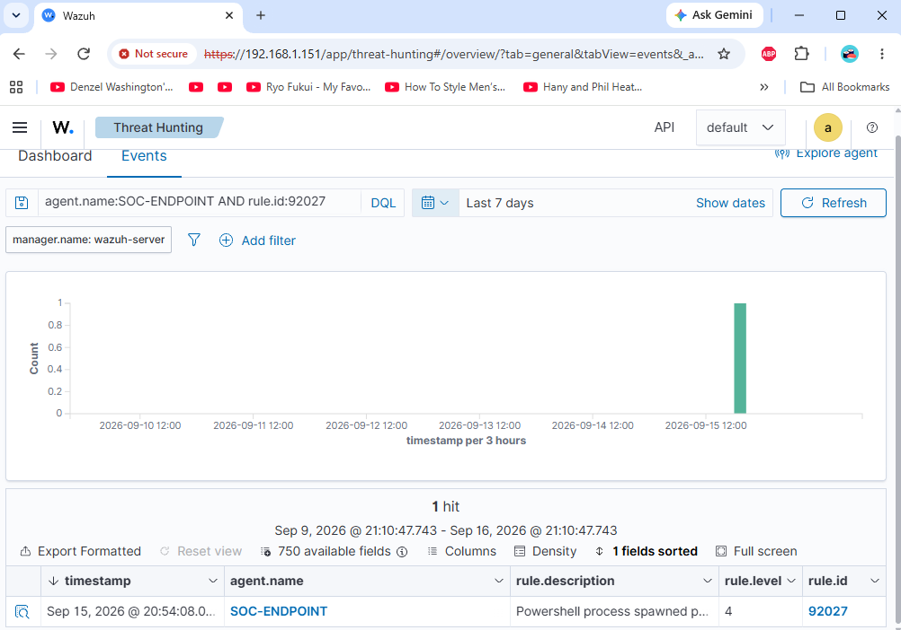
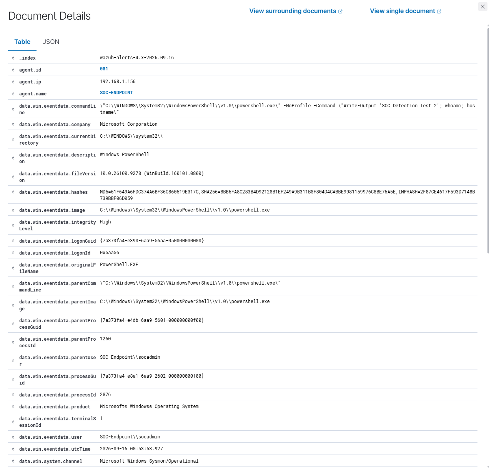
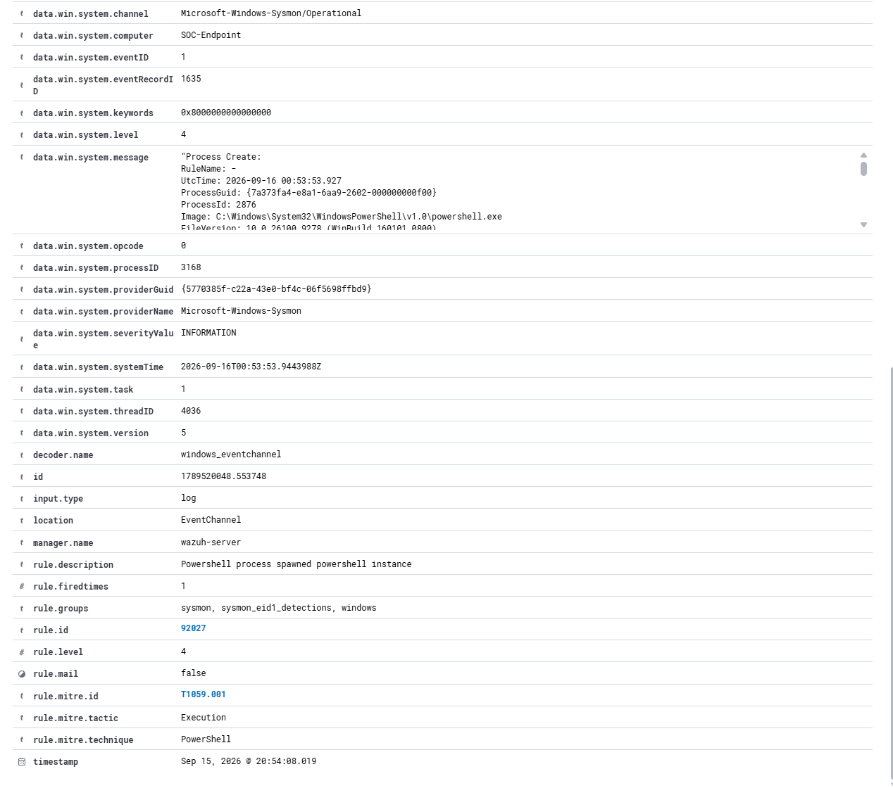
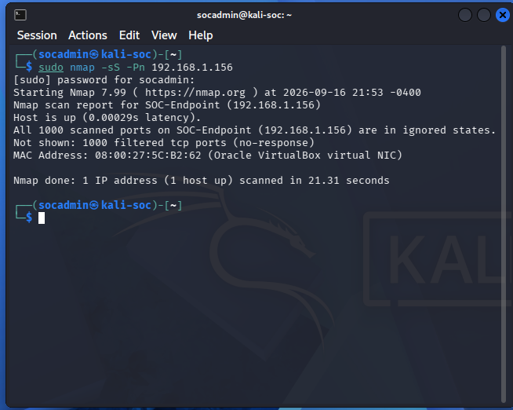
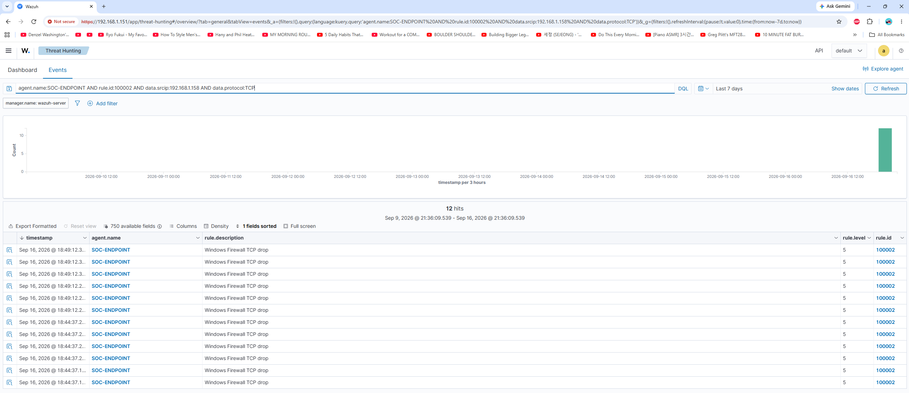
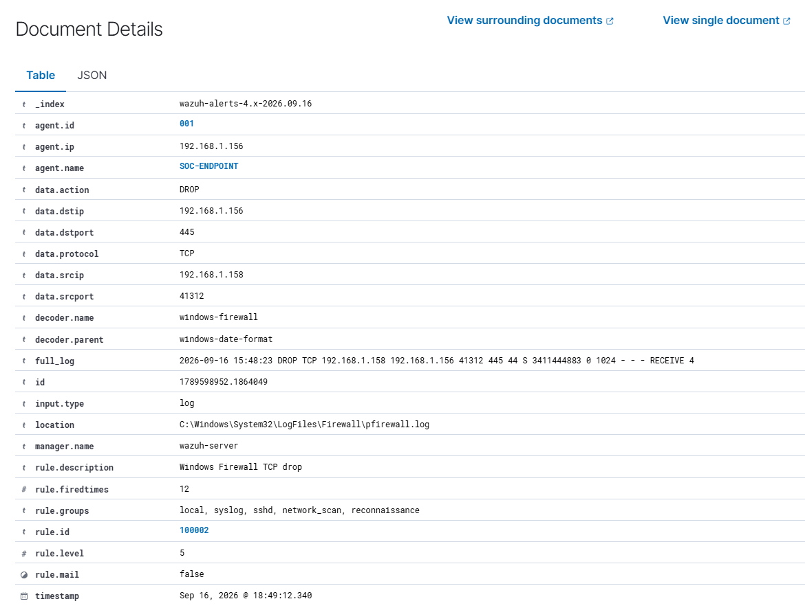
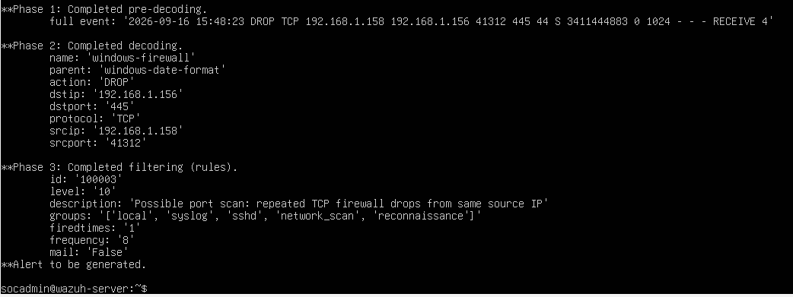

# Home SOC — SIEM Threat Detection & Incident Response

## Overview

This project documents the design and implementation of a virtualized Security Operations Center (SOC) lab using Wazuh, Windows 11, Sysmon, and Kali Linux.

The lab was built to develop hands-on experience with SIEM monitoring, endpoint telemetry, threat detection, alert triage, incident investigation, and detection engineering.

Controlled security events were generated from both Windows and Kali Linux systems and investigated through Wazuh. The project includes PowerShell execution analysis, network reconnaissance using Nmap, Windows Firewall telemetry analysis, custom Wazuh detection rules, false-positive identification, rule tuning, and detection validation.

## Table of Contents

- [Lab Objectives](#lab-objectives)
- [Lab Architecture](#lab-architecture)
- [Data Flow](#data-flow)
- [Technologies & Tools](#technologies--tools)
- [Investigation 01 — PowerShell Execution](#investigation-01--powershell-execution)
- [Investigation 02 — Network Reconnaissance & Detection Engineering](#investigation-02--network-reconnaissance--detection-engineering)
- [Custom Detection Rules](#custom-detection-rules)
- [Detection Tuning](#detection-tuning)
- [Skills Demonstrated](#skills-demonstrated)
- [Project Outcomes](#project-outcomes)
- [Conclusion](#conclusion)

## Lab Objectives

- Deploy and configure a Wazuh SIEM server
- Monitor a Windows 11 endpoint with the Wazuh agent
- Collect detailed Windows process telemetry using Sysmon
- Collect Windows Firewall logs for network activity analysis
- Generate controlled security events for investigation
- Investigate alerts using Wazuh Threat Hunting
- Map relevant activity to MITRE ATT&CK
- Develop and test custom Wazuh detection rules
- Identify and reduce false positives through rule tuning
- Document findings using a SOC-style investigation workflow

## Lab Architecture

The SOC lab was built in Oracle VirtualBox using three virtual machines connected through bridged networking.

| System | Operating System | Purpose | Lab IP |
|---|---|---|---|
| Wazuh-SOC-Server | Ubuntu Server 24.04 LTS | Wazuh manager, indexer, and dashboard | 192.168.1.151 |
| Windows-SOC-Endpoint | Windows 11 Pro | Monitored endpoint with Wazuh agent, Sysmon, and Windows Firewall logging | 192.168.1.156 |
| Kali-SOC | Kali Linux | Authorized adversary simulation and network reconnaissance | 192.168.1.158 |
### Data Flow

```text
Kali-SOC
192.168.1.158
     |
     | Controlled reconnaissance
     v
Windows-SOC-Endpoint
192.168.1.156
     |
     | Sysmon + Windows Firewall telemetry
     | Wazuh Agent
     v
Wazuh-SOC-Server
192.168.1.151
     |
     | Analysis and alerting
     v
Wazuh Dashboard / Threat Hunting
```

## Technologies & Tools

| Technology | Use in Lab |
|---|---|
| Wazuh 4.14.7 | SIEM management, log analysis, alerting, and Threat Hunting |
| Sysmon | Windows process-creation and endpoint telemetry |
| Windows 11 Pro | Monitored SOC endpoint |
| Windows Firewall | Network connection filtering and firewall telemetry |
| Kali Linux | Authorized adversary simulation and network reconnaissance |
| Nmap | TCP SYN reconnaissance and controlled network testing |
| Ubuntu Server 24.04 LTS | Wazuh server operating system |
| Oracle VirtualBox | Virtualized lab infrastructure |
| MITRE ATT&CK | Technique classification and detection mapping |
| GitHub | Investigation documentation and portfolio presentation |

## Investigation 01 — PowerShell Execution

### Objective

Generate controlled PowerShell activity on the monitored Windows endpoint and investigate the resulting alert in Wazuh.

### Test Activity

The following command was executed on `Windows-SOC-Endpoint`:

```powershell
powershell.exe -NoProfile -Command "Write-Output 'SOC Detection Test 2'; whoami; hostname"
```

### Detection

Sysmon captured the PowerShell process creation as **Event ID 1** and forwarded the telemetry to Wazuh through the Wazuh agent.

Wazuh generated the following alert:

| Field | Result |
|---|---|
| Agent | SOC-ENDPOINT |
| Wazuh Rule | 92027 |
| Rule Level | 4 |
| Event Source | Sysmon Event ID 1 |
| MITRE ATT&CK | T1059.001 — PowerShell |
| Tactic | Execution |
| Technique | PowerShell |

The alert contained process-creation telemetry including the PowerShell executable, command line, user context, integrity level, and parent process.

### Analysis

Review of the alert showed the following command-line activity:

- `powershell.exe` launched with the `-NoProfile` option
- `whoami` was executed to display the current user
- `hostname` was executed to display the endpoint hostname
- The process executed with a **High** integrity level
- The activity occurred on the monitored `SOC-ENDPOINT`

The observed command line matched the activity intentionally generated during the lab test.

Wazuh correctly detected the PowerShell process activity and mapped the event to **MITRE ATT&CK T1059.001 — PowerShell**, under the **Execution** tactic.

No additional malicious activity associated with the test was identified during the investigation.

### Disposition

**Benign True Positive — Authorized Simulation**

The alert correctly identified the PowerShell activity. However, the activity was intentionally generated as part of the authorized Home SOC lab and required no containment or remediation.

### Evidence

#### Wazuh PowerShell Alert



*Wazuh Threat Hunting identified PowerShell activity on SOC-ENDPOINT using Rule 92027.*

#### PowerShell Process Details



*Sysmon process-creation telemetry showing the PowerShell executable, command line, user context, and integrity level.*

#### Detection and MITRE ATT&CK Mapping



*Wazuh alert details showing Sysmon Event ID 1, Rule 92027, and MITRE ATT&CK T1059.001 — PowerShell.*
## Investigation 02 — Network Reconnaissance & Detection Engineering

### Objective

Simulate network reconnaissance against the monitored Windows endpoint, analyze the resulting firewall telemetry in Wazuh, and develop a custom detection for repeated TCP connection attempts.

### Test Activity

A TCP SYN scan was launched from `Kali-SOC` against `Windows-SOC-Endpoint`:

```bash
sudo nmap -sS -Pn 192.168.1.156
```

Nmap identified the target as online, while all 1,000 scanned TCP ports were reported as filtered/no-response.

### Firewall Analysis

Windows Firewall recorded and blocked inbound TCP probes generated by the scan. Wazuh collected the firewall telemetry from the monitored endpoint.

Observed activity included:

| Field | Result |
|---|---|
| Source | `192.168.1.158` — Kali-SOC |
| Destination | `192.168.1.156` — SOC-ENDPOINT |
| Protocol | TCP |
| Action | DROP |
| Example Destination Ports | 135, 139, 445 |

### Detection Engineering

Initial correlation testing produced false positives from unrelated UDP multicast traffic. The detection logic was therefore tuned to focus specifically on TCP firewall drops.

A custom rule was created to identify individual TCP firewall drops:

- **Rule:** 100002
- **Level:** 5
- **Description:** Windows Firewall TCP drop

A second correlation rule was created to identify repeated TCP firewall drops from the same source:

- **Rule:** 100003
- **Level:** 10
- **Threshold:** 8 events within 60 seconds
- **Description:** Possible port scan: repeated TCP firewall drops from same source IP

Live Wazuh telemetry confirmed Rule 100002 against traffic generated from `192.168.1.158`. The Rule 100003 correlation logic was successfully validated using `wazuh-logtest`.

> **Validation Note:** Rule 100003 was not observed firing in the live Threat Hunting index during final validation. Therefore, Rule 100003 is documented as successfully validated with `wazuh-logtest`, rather than as a live SIEM alert.

### Analysis

The source IP matched the Kali system used for the authorized reconnaissance test. Windows Firewall blocked the observed connection attempts, and Nmap reported the scanned ports as filtered/no-response.

No successful connection or evidence of compromise was identified during the test.

### Disposition

**Benign True Positive — Authorized Reconnaissance Simulation**

The observed firewall activity was generated by the authorized Kali reconnaissance test. The connection attempts were blocked by Windows Firewall, and no successful connection or evidence of compromise was identified.

### Evidence

#### Kali Nmap SYN Scan



*Authorized TCP SYN reconnaissance from Kali-SOC against Windows-SOC-Endpoint. Nmap reported all 1,000 scanned TCP ports as filtered/no-response.*

#### Wazuh TCP Drop Detection



*Wazuh Threat Hunting showing TCP firewall-drop events from Kali-SOC (`192.168.1.158`) detected by custom Rule 100002.*

#### Firewall Event Details



*Windows Firewall telemetry showing TCP traffic from `192.168.1.158` to `192.168.1.156` blocked with action DROP and detected by Rule 100002.*

#### Correlation Rule Validation



*Wazuh `wazuh-logtest` validation showing Rule 100003 generating a Level 10 alert after the configured threshold of eight matching TCP firewall-drop events within 60 seconds.*

## Custom Detection Rules

As part of the detection-engineering portion of the lab, custom Wazuh rules were developed to improve visibility into network reconnaissance activity observed through Windows Firewall telemetry.

### Rule 100002 — Windows Firewall TCP Drop

Rule 100002 identifies individual TCP connection attempts blocked by Windows Firewall.

```xml
<rule id="100002" level="5">
    <if_sid>4101</if_sid>
    <protocol>TCP</protocol>
    <description>Windows Firewall TCP drop</description>
    <group>network_scan,reconnaissance,</group>
</rule>
```

This rule was successfully observed in live Wazuh telemetry during authorized Nmap reconnaissance from `Kali-SOC`.

### Rule 100003 — Repeated TCP Firewall Drops

Rule 100003 correlates repeated Rule 100002 events from the same source IP within a defined time window.

```xml
<rule id="100003" level="10" frequency="8" timeframe="60">
    <if_matched_sid>100002</if_matched_sid>
    <same_srcip />
    <description>Possible port scan: repeated TCP firewall drops from same source IP</description>
    <group>network_scan,reconnaissance,</group>
</rule>
```

The rule is configured to generate a Level 10 alert when eight matching TCP firewall-drop events from the same source IP occur within 60 seconds.

Rule 100003 was successfully validated using `wazuh-logtest`. It was not observed firing in the live Threat Hunting index during final validation, so the project does not represent it as a live SIEM alert.

### Detection Tuning

Initial correlation testing produced false positives from unrelated UDP multicast traffic. Analysis of those events showed that the original correlation logic was too broad.

The detection was refined by separating the logic into two stages:

1. Rule 100002 filters Windows Firewall events to TCP traffic.
2. Rule 100003 correlates repeated Rule 100002 events from the same source IP.

This tuning reduced unrelated UDP traffic from the correlation logic and demonstrated an iterative detection-engineering workflow: **observe → analyze → tune → validate**.

## Skills Demonstrated

- SIEM deployment, configuration, and monitoring with Wazuh
- Windows endpoint monitoring using the Wazuh Agent
- Sysmon process-creation telemetry collection and analysis
- Windows Firewall log collection and network-event investigation
- Threat Hunting and alert investigation in Wazuh
- PowerShell activity analysis and MITRE ATT&CK mapping
- Network reconnaissance using Nmap in an authorized lab environment
- Custom Wazuh rule development and validation
- Correlation-rule testing using `wazuh-logtest`
- False-positive analysis and detection tuning
- SOC-style alert triage, investigation, and documentation
## Project Outcomes

This project resulted in a functional virtual Home SOC capable of collecting endpoint and network telemetry, detecting controlled security activity, and supporting analyst investigation through Wazuh.

Key outcomes included:

- Successfully deployed a Wazuh SIEM environment with a monitored Windows endpoint.
- Integrated Sysmon and Windows Firewall telemetry into Wazuh.
- Investigated PowerShell execution detected by Wazuh and mapped the activity to MITRE ATT&CK T1059.001 — PowerShell.
- Generated authorized TCP SYN reconnaissance from Kali Linux and analyzed the resulting Windows Firewall DROP events.
- Developed custom Rule 100002 to identify TCP firewall drops and confirmed the rule against live Wazuh telemetry.
- Developed correlation Rule 100003 to identify repeated TCP firewall drops from the same source IP and validated the rule using `wazuh-logtest`.
- Identified false positives caused by unrelated UDP multicast traffic and refined the detection logic to focus on relevant TCP activity.
- Documented investigation evidence, analyst conclusions, detection logic, and validation results in a GitHub portfolio.

## Conclusion

This Home SOC project demonstrates the implementation of a security monitoring and detection workflow using Wazuh, Sysmon, Windows Firewall telemetry, and Kali Linux.

The lab progressed beyond basic SIEM deployment by incorporating alert investigation, MITRE ATT&CK mapping, network reconnaissance analysis, custom detection-rule development, false-positive analysis, rule tuning, and validation.

Through the two documented investigations, the environment demonstrated the ability to collect security telemetry, identify suspicious activity, analyze supporting evidence, develop and refine detections, and document analyst conclusions in a repeatable SOC-style workflow.

The project provided practical experience applying concepts associated with SIEM operations, endpoint monitoring, threat detection, incident investigation, and detection engineering in an authorized lab environment.
